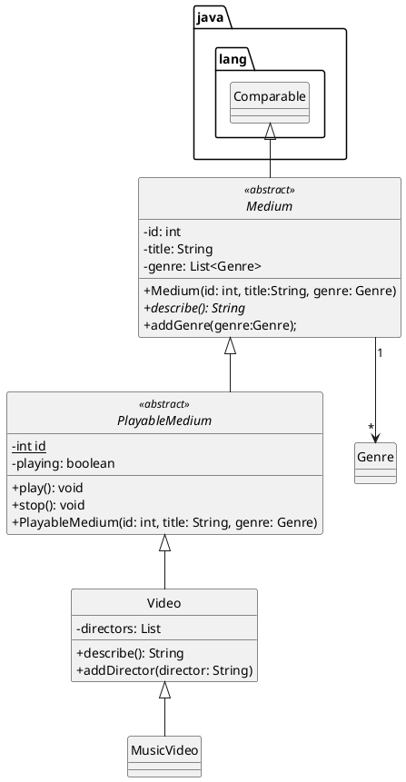

# Schoolsummary

Voornaam: Lloyd

Achternaam: Larbi

Studentnummer: 500828840

### Inleiding

Dit is een applicatie waarmee je als student of docent 
zijnde een klasoverzicht krijgt. Mocht je een nieuwe student 
of docent zijn wordt je ingeschreven voor het schooljaar en krijg
je vervolgens een klasoverzicht te zien.

### UML class diagram

Vervang de tekst onder deze header met een link naar je uml-class-diagram plaatje. Hieronder een voorbeeld hoe je in markdown naar een plaatje kan linken:

```markdown
  
```

Je kunt [plantuml](https://plugins.jetbrains.com/plugin/7017-plantuml-integration) gebruiken om uml diagrammen mee te
maken. Gebruik onderstaande template gebruiken om jezelf op weg te helpen. Je kan de documentatie hier
raadplegen: https://plantuml.com/class-diagram.



### Voorwaarden programma

#### OOP1

##### 1. Het commando `git log --pretty=format:"%hx %ad%x09%s" --date=short` bevat inzichtelijke atomaire commits op.

```
Plaats hier het resultaat van git log --pretty=format:"%hx %ad%x09%s" --date=short`
```

Bewijs:  [linknaarhetbronbestandinjerepo](https://gitlab.fdmci.hva.nl/repo-van-jou)

##### 2. Abstract class 'A' correct geïmplementeerd

```java
public abstract class Person { 
    
}

```

Bewijs:  [linknaarhetbronbestandinjerepo](https://gitlab.fdmci.hva.nl/repo-van-jou)

##### 3. Subclass implementeert abstract class

```
public class Student extends Person implements Presence{
    
}

public class Teacher extends Person implements Presence{
    
}
```

Bewijs:  [linknaarhetbronbestandinjerepo](https://gitlab.fdmci.hva.nl/repo-van-jou)

##### 4. Interface correct geïmplementeerd.

```java
public class Student extends Person implements Presence{

}

public class Teacher extends Person implements Presence{

}
```

Bewijs:  [linknaarhetbronbestandinjerepo](https://gitlab.fdmci.hva.nl/repo-van-jou)

##### 5. Er is een klasse aanwezig met minimaal twee constructors

```java
H3B = new SchoolClass(2021, "H3B", romeo, students);

H3B.replaceTeacher(new Teacher(getRandomNumberString(), inName, intype, inMail, inBirthDate, inGen,inteach));

H3B.addOneStudent(new Student(getRandomNumberString(), inName, intype, inMail,inGen, inBirthDate, inSub));


```

Bewijs:  [linknaarhetbronbestandinjerepo](https://gitlab.fdmci.hva.nl/repo-van-jou)

##### 6. `super` keyword gebruikt voor aanroep constructor

```java
Plaats hier je code snippets
```

Bewijs:  [linknaarhetbronbestandinjerepo](https://gitlab.fdmci.hva.nl/repo-van-jou)

##### 7. `super` keyword gebruikt voor aanroep methode

```java
public Student(String id, String name, String role, String email,String inGen, String inBirthDate, String inSub) {     
    super.setId(id);
    super.setName(name);
    super.setRole(role);
    super.setEmail(email);
    super.setGender(inGen);
    super.setBirthday(inBirthDate);
    super.setSubject(inSub);
}
```

Bewijs:  [linknaarhetbronbestandinjerepo](https://gitlab.fdmci.hva.nl/repo-van-jou)

##### 8. `instanceof` aangetoond

```java
public static void view (Person c) {
    if (c instanceof Student) {
        Student b1 = (Student ) c;
        b1.check();
    }
}

Person c = new Student();
Student.view(c);

```

Bewijs:  [linknaarhetbronbestandinjerepo](https://gitlab.fdmci.hva.nl/repo-van-jou)

##### 9. cast gebruikt voor gebruik van classe-specifieke methodes

```java
Plaats hier je code snippets
```

Bewijs:  [linknaarhetbronbestandinjerepo](https://gitlab.fdmci.hva.nl/repo-van-jou)

##### 10. Er is testcode aanwezig om de punten hierboven te demonstreren. (Als je ook OOP2 doet: gebruik testcode-voorwaarden van OOP2)

```java
Plaats hier je code snippets
```

Bewijs:  [linknaarhetbronbestandinjerepo]

##### 11. Classes en methodes zijn voldoen aan HBO-ICT coding standards

```java
Plaats hier je meest ingewikkelde stukje code met javadoc,en normaal commentaar  
```

Bewijs:  [linknaarhetbronbestandinjerepo](https://gitlab.fdmci.hva.nl/repo-van-jou)


#### OOP2

Naast de OOP1 voorwaarden dient je OOP2 programma aan de volgende voorwaarden te voldoen:

##### 1. Gebruikt en implementeert minimaal 2 functionele interfaces uit de package `java.util.function`
```java
Plaats hier je code snippets
```

Bewijs:  [linknaarhetbronbestandinjerepo](https://gitlab.fdmci.hva.nl/repo-van-jou)

##### 2. Een classe met 2 endpoints (d.m.v. Javalin framework)

1. GET request waarbij er data uit een tekstbestand wordt gelezen en terug gestuurd.
2. POST request waarbij er data wordt weggeschreven naar een tekstbestand.
```java
Plaats hier je code snippets voor GET request
```

Bewijs:  [linknaarhetbronbestandinjerepo](https://gitlab.fdmci.hva.nl/repo-van-jou)

```java
Plaats hier je code snippets voor POST request
```

Bewijs:  [linknaarhetbronbestandinjerepo]

##### 3. Een custom Exception "E" gedefiniëerd.

```java
Plaats hier je code snippets
```

Bewijs:  [linknaarhetbronbestandinjerepo](https://gitlab.fdmci.hva.nl/repo-van-jou)

##### 4. Custom Exception "E" wordt gebruikt via een `throws` constructie.

```java
Plaats hier je code snippets
```

Bewijs:  [linknaarhetbronbestandinjerepo](https://gitlab.fdmci.hva.nl/repo-van-jou)

##### 5. Custom Exception "E" wordt gebruikt via een `catch` constructie

```java
Plaats hier je code snippets
```

Bewijs:  [linknaarhetbronbestandinjerepo](https://gitlab.fdmci.hva.nl/repo-van-jou)

##### 6. Minimaal 1 `intermediate operation` op een stream

```java
Plaats hier je code snippets
```

Bewijs:  [linknaarhetbronbestandinjerepo](https://gitlab.fdmci.hva.nl/repo-van-jou)

##### 7. Minimaal 1 `terminal operation` op een stream

```java
Plaats hier je code snippets
```

Bewijs:  [linknaarhetbronbestandinjerepo](https://gitlab.fdmci.hva.nl/repo-van-jou)

##### 8. Unit tests met minimaal 60% code coverage (getters en setters tellen niet mee)

```java
Plaats hier je code snippets
```

Bewijs:  [linknaarhetbronbestandinjerepo](https://gitlab.fdmci.hva.nl/repo-van-jou)

