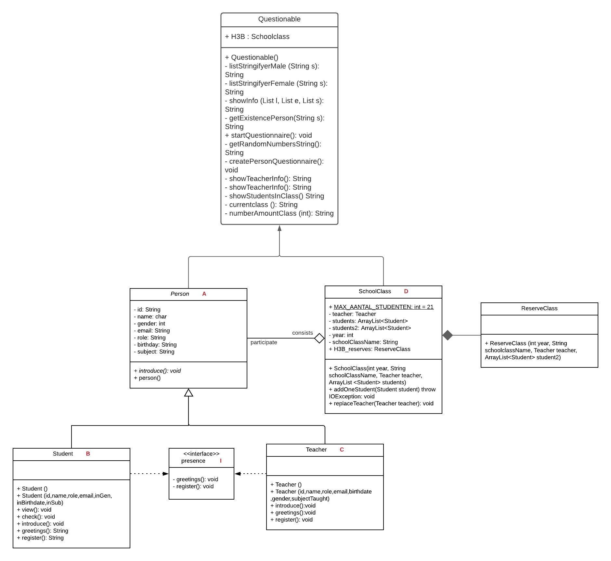

# Schoolsummary

Voornaam: Lloyd

Achternaam: Larbi

Studentnummer: 500828840

### Inleiding

Dit is een applicatie waarmee je als student of docent 
zijnde een klasoverzicht krijgt te zien van een herkansersklas. Mocht je een nieuwe student of docent zijn wordt je ingeschreven voor het schooljaar en krijg
je vervolgens een klasoverzicht te zien.Mocht de klas volzitten kom je in een reserveklas waarbij je indien iemand de herkansersklas niet wilt/hoeft te attenderen jij de plek van diegene krijgt. Mocht dat niet het geval zijn doe wordt je ingeschreven voor het jaar daarop. 

### UML class diagram

https://gitlab.fdmci.hva.nl/2020-2021-oop-dt/herkansers/larbi-lloyd-tentamen/-/blob/master/src/main/java/nl/hva/schoolSummary/UML%20OOP1%20&%20OOP2%20SchoolSummary.jpeg

Vervang de tekst onder deze header met een link naar je uml-class-diagram plaatje. Hieronder een voorbeeld hoe je in markdown naar een plaatje kan linken:

```markdown
  
```


### Voorwaarden programma

#### OOP1

##### 1. Het commando `git log --pretty=format:"%hx %ad%x09%s" --date=short` bevat inzichtelijke atomaire commits op.

06e3492x 2021-06-21     Final commit
1904ecdx 2021-05-16     OOP1 lijkt klaar en het einde van oop 2 komt in zicht. Ik heb nu een md file en heb Javalin erin verwerkt.
239a116x 2021-05-14     OOP1 lijkt klaar en het einde van oop 2 komt in zicht
f0fcbafx 2021-04-16     OOP1 lijkt klaar
9edfb65x 2021-04-16     OOP1
c47fe60x 2021-04-16     First commit
fa2295bx 2021-04-16     Update README.md

Bewijs:  https://gitlab.fdmci.hva.nl/2020-2021-oop-dt/herkansers/larbi-lloyd-tentamen/-/blob/master/src/main/java/nl/hva/schoolSummary/Person.java

##### 2. Abstract class 'A' correct geïmplementeerd

```java
                                          
public abstract class Person { 
    
}

```

Bewijs: https://gitlab.fdmci.hva.nl/2020-2021-oop-dt/herkansers/larbi-lloyd-tentamen/-/blob/master/src/main/java/nl/hva/schoolSummary/Student.java
                   
https://gitlab.fdmci.hva.nl/2020-2021-oop-dt/herkansers/larbi-lloyd-tentamen/-/blob/master/src/main/java/nl/hva/schoolSummary/Teacher.java

##### 3. Subclass implementeert abstract class

```
public class Student extends Person implements Presence{
    
}

public class Teacher extends Person implements Presence{
    
}
```

Bewijs:  https://gitlab.fdmci.hva.nl/2020-2021-oop-dt/herkansers/larbi-lloyd-tentamen/-/blob/master/src/main/java/nl/hva/schoolSummary/Student.java
                   
https://gitlab.fdmci.hva.nl/2020-2021-oop-dt/herkansers/larbi-lloyd-tentamen/-/blob/master/src/main/java/nl/hva/schoolSummary/Teacher.java

##### 4. Interface correct geïmplementeerd.

```java
public class Student extends Person implements Presence{

}

public class Teacher extends Person implements Presence{

}
```

Bewijs:  https://gitlab.fdmci.hva.nl/2020-2021-oop-dt/herkansers/larbi-lloyd-tentamen/-/blob/master/src/main/java/nl/hva/schoolSummary/Questionable.java

##### 5. Er is een klasse aanwezig met minimaal twee constructors

```java
                                          
public class Questionable {
    
H3B = new SchoolClass(2021, "H3B", romeo, students);

H3B.replaceTeacher(new Teacher(getRandomNumberString(), inName, intype, inMail, inBirthDate, inGen,inteach));

H3B.addOneStudent(new Student(getRandomNumberString(), inName, intype, inMail,inGen, inBirthDate, inSub));

Bewijs:  [linknaarhetbronbestandinjerepo](https://gitlab.fdmci.hva.nl/repo-van-jou)

##### 6. `super` keyword gebruikt voor aanroep constructor

```java
Plaats hier je code snippets
```

Bewijs: https://gitlab.fdmci.hva.nl/2020-2021-oop-dt/herkansers/larbi-lloyd-tentamen/-/blob/master/src/main/java/nl/hva/schoolSummary/Student.java

##### 7. `super` keyword gebruikt voor aanroep methode

```java
public Student(String id, String name, String role, String email,String inGen, String inBirthDate, String inSub) {     
    super.setId(id);
    super.setName(name);
    super.setRole(role);
    super.setEmail(email);
    super.setGender(inGen);
    super.setBirthday(inBirthDate);
    super.setSubject(inSub);
}
```

Bewijs:  https://gitlab.fdmci.hva.nl/2020-2021-oop-dt/herkansers/larbi-lloyd-tentamen/-/blob/master/src/main/java/nl/hva/schoolSummary/Main.java)
                                          
https://gitlab.fdmci.hva.nl/2020-2021-oop-dt/herkansers/larbi-lloyd-tentamen/-/blob/master/src/main/java/nl/hva/schoolSummary/Student.java

##### 8. `instanceof` aangetoond

```java
public static void view (Person c) {
    if (c instanceof Student) {
        Student b1 = (Student ) c;
        b1.check();
    }
}

Person c = new Student();
Student.view(c);

```

Bewijs:  [linknaarhetbronbestandinjerepo](https://gitlab.fdmci.hva.nl/repo-van-jou)

##### 9. cast gebruikt voor gebruik van classe-specifieke methodes

```java
Plaats hier je code snippets
```

Bewijs:  [linknaarhetbronbestandinjerepo](https://gitlab.fdmci.hva.nl/repo-van-jou)

##### 10. Er is testcode aanwezig om de punten hierboven te demonstreren. (Als je ook OOP2 doet: gebruik testcode-voorwaarden van OOP2)

```java
Plaats hier je code snippets
```

Bewijs:  [linknaarhetbronbestandinjerepo]

##### 11. Classes en methodes zijn voldoen aan HBO-ICT coding standards

```java
  private void createPersonQuestionnaire() throws Exception {
        System.out.println("What is your gender?");
        String inGen = new Scanner(System.in).nextLine();

        System.out.println("What is your name?");
        String inName = new Scanner(System.in).nextLine();

        try{
            System.out.println("What year is it?");
            int inyear = new Scanner(System.in).nextInt();
            H3B.setYear(inyear);
        } catch (Exception e){
            System.out.println("You can only type numbers!");
            H3B.setYear(H3B.getYear());
        }

        System.out.println("What is your mail?");
        String inMail = new Scanner(System.in).nextLine();

        System.out.println("What is your birthdate?");
        String inBirthDate = new Scanner(System.in).nextLine();

        /**
         * This is a point where you have to choose if you want to register as a teacher or student for the class.
         * Depending on what you'll choose you will be added to the class, as either a teacher or student.
         */

        System.out.println("Are you a teacher or a student?");
        String intype = new Scanner(System.in).nextLine();


        switch (intype) {
            case "Teacher", "teacher" -> {

                System.out.println("What subject do you teach?");
                String inteach = new Scanner(System.in).nextLine();

                getRandomNumberString();
                H3B.replaceTeacher(new Teacher(getRandomNumberString(), inName, intype, inMail, inBirthDate, inGen,inteach));

                /**
                 * After you have chosen the option teacher a markdown file will be created with your information as a teacher and about the class.
                 * You'll also be provided with a link which will display your information.
                 */
                try {
                    FileWriter myWriter = new FileWriter("registrationForm.md",false);
                    myWriter.write(showTeacherInfo());
                    myWriter.close();
                    System.out.println("Successfully wrote to the file.");
                    System.out.println();
                    app.get("/me", ctx -> ctx.result(showTeacherInfo()));
                    System.out.println("You can check your information online on http://localhost:7000/me");
                    try {
                        File readMe = new File("registrationForm.md");
                        Scanner myReader = new Scanner(readMe);
                        while (myReader.hasNextLine()) {
                            String data = myReader.nextLine();
                            System.out.println(data);
                        }
                        myReader.close();
                    } catch (FileNotFoundException e) {
                        System.out.println("An error occurred.");
                        e.printStackTrace();
                    }
                } catch (IOException e) {
                    System.out.println("An error occurred.");
                    e.printStackTrace();
                }

            }

            /**
             * After you have chosen the option teacher a markdown file will be created with your information as a student and about the class.
             * You'll also be provided with a link which will display your information.
             * If the schoolclass is full you'll be added to the H3B reserves class which is a shortlist in case somebody decides not to attend the H3B class, otherwise you'll have to try next year.
             */

            case "Student", "student" -> {

                System.out.println("What subject do you follow?");
                String inSub = new Scanner(System.in).nextLine();


                getRandomNumberString();
                H3B.addOneStudent(new Student(getRandomNumberString(), inName, intype, inMail,inGen, inBirthDate, inSub));

                try {
                    FileWriter myWriter = new FileWriter("registrationForm.md",false);
                    myWriter.write(showStudentInfo());
                    myWriter.close();
                    System.out.println("Successfully wrote to the file.");
                    System.out.println();
                    app.get("/me", ctx -> ctx.result(showStudentInfo()));
                    System.out.println("You can check your information online on http://localhost:7000/me");
                    try {
                        File readMe = new File("registrationForm.md");
                        Scanner myReader = new Scanner(readMe);
                        while (myReader.hasNextLine()) {
                            String data = myReader.nextLine();
                            System.out.println(data);
                        }
                        myReader.close();
                    } catch (FileNotFoundException e) {
                        System.out.println("An error occurred.");
                        e.printStackTrace();
                    }
                } catch (IOException e) {
                    System.out.println("An error occurred.");
                    e.printStackTrace();
                }
            }
        }
    }
```

Bewijs: https://gitlab.fdmci.hva.nl/2020-2021-oop-dt/herkansers/larbi-lloyd-tentamen/-/blob/master/src/main/java/nl/hva/schoolSummary/Questionable.java

#### OOP2

Naast de OOP1 voorwaarden dient je OOP2 programma aan de volgende voorwaarden te voldoen:

##### 1. Gebruikt en implementeert minimaal 2 functionele interfaces uit de package `java.util.function`
    public static Function<Integer, String> numberAmountClass = number -> {
        if (number %2 ==0){
            return "The amount of students in class H3B is "+ number + ", that is an even number.";
        } else {
            return "The amount of students in class H3B is "+ number + ", that is an odd number.";
        }
    };
                                          
Function<List, Integer> femaleSize = List::size;

        Integer femaleNumber = femaleSize.apply(femaleStudentsID);                                          
```

Bewijs: https://gitlab.fdmci.hva.nl/2020-2021-oop-dt/herkansers/larbi-lloyd-tentamen/-/blob/master/src/main/java/nl/hva/schoolSummary/Questionable.java

##### 2. Een classe met 2 endpoints (d.m.v. Javalin framework)

1. GET request waarbij er data uit een tekstbestand wordt gelezen en terug gestuurd.
2. POST request waarbij er data wordt weggeschreven naar een tekstbestand.
                                          
```app.get("/", ctx -> ctx.result(currentClass()));
```
Bewijs: https://gitlab.fdmci.hva.nl/2020-2021-oop-dt/herkansers/larbi-lloyd-tentamen/-/blob/master/src/main/java/nl/hva/schoolSummary/Questionable.java

```java
Plaats hier je code snippets voor POST request
```

Bewijs:  [linknaarhetbronbestandinjerepo]

##### 3. Een custom Exception "E" gedefiniëerd.

```java
                    try {
                        File readMe = new File("registrationForm.md");
                        Scanner myReader = new Scanner(readMe);
                        while (myReader.hasNextLine()) {
                            String data = myReader.nextLine();
                            System.out.println(data);
                        }
                        myReader.close();
                    } catch (FileNotFoundException e) {
                        System.out.println("An error occurred.");
                        e.printStackTrace();
                    }
```

Bewijs: https://gitlab.fdmci.hva.nl/2020-2021-oop-dt/herkansers/larbi-lloyd-tentamen/-/blob/master/src/main/java/nl/hva/schoolSummary/Questionable.java

##### 4. Custom Exception "E" wordt gebruikt via een `throws` constructie.

```java
private void createPersonQuestionnaire() throws IOException {
        System.out.println("What is your gender?");
        String inGen = new Scanner(System.in).nextLine();

        System.out.println("What is your name?");
        String inName = new Scanner(System.in).nextLine();

        try{
            System.out.println("What year is it?");
            int inyear = new Scanner(System.in).nextInt();
            H3B.setYear(inyear);
        } catch (Exception e){
            System.out.println("You can only type numbers!");
            H3B.setYear(H3B.getYear());
        }

        System.out.println("What is your mail?");
        String inMail = new Scanner(System.in).nextLine();

        System.out.println("What is your birthdate?");
        String inBirthDate = new Scanner(System.in).nextLine();

        System.out.println("Are you a teacher or a student?");
        String intype = new Scanner(System.in).nextLine();


        switch (intype) {
            case "Teacher", "teacher" -> {

                System.out.println("What subject do you teach?");
                String inteach = new Scanner(System.in).nextLine();

                getRandomNumberString();
                H3B.replaceTeacher(new Teacher(getRandomNumberString(), inName, intype, inMail, inBirthDate, inGen,inteach));
                try {
                    FileWriter myWriter = new FileWriter("registrationForm.md",false);
                    myWriter.write(showTeacherInfo());
                    myWriter.close();
                    System.out.println("Successfully wrote to the file.");
                    System.out.println();
                    app.get("/me", ctx -> ctx.result(showTeacherInfo()));
                    System.out.println("You can check your information online on http://localhost:7000/me");
                    try {
                        File readMe = new File("registrationForm.md");
                        Scanner myReader = new Scanner(readMe);
                        while (myReader.hasNextLine()) {
                            String data = myReader.nextLine();
                            System.out.println(data);
                        }
                        myReader.close();
                    } catch (FileNotFoundException e) {
                        System.out.println("An error occurred.");
                        e.printStackTrace();
                    }
                } catch (IOException e) {
                    System.out.println("An error occurred.");
                    e.printStackTrace();
                }

            }


            case "Student", "student" -> {

                System.out.println("What subject do you follow?");
                String inSub = new Scanner(System.in).nextLine();


                getRandomNumberString();
                H3B.addOneStudent(new Student(getRandomNumberString(), inName, intype, inMail,inGen, inBirthDate, inSub));

                try {
                    FileWriter myWriter = new FileWriter("registrationForm.md",false);
                    myWriter.write(showStudentInfo());
                    myWriter.close();
                    System.out.println("Successfully wrote to the file.");
                    System.out.println();
                    app.get("/me", ctx -> ctx.result(showStudentInfo()));
                    System.out.println("You can check your information online on http://localhost:7000/me");
                    try {
                        File readMe = new File("registrationForm.md");
                        Scanner myReader = new Scanner(readMe);
                        while (myReader.hasNextLine()) {
                            String data = myReader.nextLine();
                            System.out.println(data);
                        }
                        myReader.close();
                    } catch (FileNotFoundException e) {
                        System.out.println("An error occurred.");
                        e.printStackTrace();
                    }
                } catch (IOException e) {
                    System.out.println("An error occurred.");
                    e.printStackTrace();
                }
            }
        }
    }
                                              public void addOneStudent(Student student) throws IOException {
        if (students.size() >= MAX_AANTAL_STUDENTEN ){
            StringBuilder sb = new StringBuilder();
            sb.append(MAX_AANTAL_STUDENTEN);
            ArrayList<Student> students2 = new ArrayList<>();
            this.students2 = students2;
            students2.add(student);
            H3B_reserves = new ReserveClass (getYear(),getSchoolClassName()+" Reserve",getTeacher(),getStudents2());
           throw new IOException ("There are currently "+ sb +" students in the class, the class is full. \n"+
                   "You'll be added to "+H3B_reserves.getSchoolClassName()+".\n");
        } else{
            students.add(student);
        }
    }
                                          
```

Bewijs:  https://gitlab.fdmci.hva.nl/2020-2021-oop-dt/herkansers/larbi-lloyd-tentamen/-/blob/master/src/main/java/nl/hva/schoolSummary/Questionable.java

https://gitlab.fdmci.hva.nl/2020-2021-oop-dt/herkansers/larbi-lloyd-tentamen/-/blob/master/src/main/java/nl/hva/schoolSummary/SchoolClass.java

##### 5. Custom Exception "E" wordt gebruikt via een `catch` constructie

```java
                   try {
                        File readMe = new File("registrationForm.md");
                        Scanner myReader = new Scanner(readMe);
                        while (myReader.hasNextLine()) {
                            String data = myReader.nextLine();
                            System.out.println(data);
                        }
                        myReader.close();
                    } catch (FileNotFoundException e) {
                        System.out.println("An error occurred.");
                        e.printStackTrace();
                    }
```

Bewijs:  https://gitlab.fdmci.hva.nl/2020-2021-oop-dt/herkansers/larbi-lloyd-tentamen/-/blob/master/src/main/java/nl/hva/schoolSummary/Questionable.java

##### 6. Minimaal 1 `intermediate operation` op een stream

```java
        List <String> femaleStudentsMail = students.stream()
                .filter(Student -> Student.getGender().equals("F"))
                .map(Person::getEmail )
                .collect(Collectors.toList());

        List <String> maleStudentsID = students.stream()
                .filter(Student -> Student.getGender().equals("M"))
                .map(Person::getId)
                .collect(Collectors.toList());
```

Bewijs: https://gitlab.fdmci.hva.nl/2020-2021-oop-dt/herkansers/larbi-lloyd-tentamen/-/blob/master/src/main/java/nl/hva/schoolSummary/Questionable.java

##### 7. Minimaal 1 `terminal operation` op een stream

```java
        List <String> femaleStudentsMail = students.stream()
                .filter(Student -> Student.getGender().equals("F"))
                .map(Person::getEmail )
                .collect(Collectors.toList());

        List <String> maleStudentsID = students.stream()
                .filter(Student -> Student.getGender().equals("M"))
                .map(Person::getId)
                .collect(Collectors.toList());
```

Bewijs: https://gitlab.fdmci.hva.nl/2020-2021-oop-dt/herkansers/larbi-lloyd-tentamen/-/blob/master/src/main/java/nl/hva/schoolSummary/Questionable.java

##### 8. Unit tests met minimaal 60% code coverage (getters en setters tellen niet mee)

```java
    @Test
    void replaceTeacher() {

        Teacher Adam = new Teacher("776553", "Adam", "Teacher", "Adam.berends@hva.nl",
                "04-05-2021", "M", "Math");

        ArrayList<Student> testStudents2 = new ArrayList<>();

        SchoolClass K4B = new SchoolClass(2022, "K4B", Adam, testStudents2);

        testStudents2.add(new Student("809567", "Gudo", "Student", "Gudo.Soeterik@hva.nl","M","04-05-2021","Economics"));


        K4B.replaceTeacher(new Teacher("677683","Lloyd","Teacher", "lloyd.larbi@hva.nl", "01-01-1997", "M","Math"));


        Assertions.assertEquals("Lloyd", K4B.getTeacher().getName()) ;


    }

        ArrayList<Student> testStudents1 = new ArrayList<>();
        Teacher Johnson = new Teacher("768345", "Johnson", "Teacher", "Johnson.Thomasen@hva.nl",
                "04-05-2021", "M", "Math");
        SchoolClass K4A = new SchoolClass(2022, "K4A", Johnson, testStudents1);

        testStudents1.add(new Student("809567", "Gudo", "Student", "Gudo.Soeterik@hva.nl","M","04-05-2021","Economics"));
        testStudents1.add(new Student("678234", "Joep ", "Student", "Joep.ter.Keurs@hva.nl","M","04-05-2021","Culture"));
        testStudents1.add(new Student("742342", "Jochem", "Student", "Jochem.Ingelse@hva.nl","M","04-05-2021","Economics"));
        testStudents1.add(new Student("645432", "Robbert-Jan", "Student", "Robbert-Jan.Hamhuis@hva.nl","M","04-05-2021","Programming"));
        testStudents1.add(new Student("123264", "Laurens", "Student", "Laurens.Kunst@hva.nl","M","04-05-2021","Programming"));
        testStudents1.add(new Student("856345", "Corneel", "Student", "Corneel.Barneveld@hva.nl","M","04-05-2021","Economics"));
        testStudents1.add(new Student("577543", "Twan", "Student", "Twan.de.Chalmot@hva.nl","M","04-05-2021","Programming"));
        testStudents1.add(new Student("645675", "Wouter", "Student", "Wouter.Koot@hva.nl","M","04-05-2021","Economics"));
        testStudents1.add(new Student("809567", "Willem", "Student", "Willem.de.valk@hva.nl","M","04-05-2021","Culture"));
        testStudents1.add(new Student("768323", "Louwrens", "Student", "Louwrens.Mooiers@hva.nl","M","04-05-2021","Economics"));
        testStudents1.add(new Student("789654", "Alie", "Student", "Alie.Worst@hva.nl","M","04-05-2021","Programming"));
        testStudents1.add(new Student("809567", "Ewoud", "Student", "Ewoud.Markvoort@hva.nl","M","04-05-2021","Science"));
        testStudents1.add(new Student("809567", "Nard", "Student", "Nard.Buitenhuis@hva.nl","M","04-05-2021","Economics"));
        testStudents1.add(new Student("809567", "Iemke", "Student", "Iemke.Siemelink@hva.nl","F","04-05-2021","Culture"));
        testStudents1.add(new Student("809567", "Leonie", "Student", "Leonie.van.den.Belten@hva.nl","F","04-05-2021","Science"));
        testStudents1.add(new Student("809567", "Rosemarije", "Student", "Rosemarije.Vloedbeld@hva.nl","F","04-05-2021","Culture"));
        testStudents1.add(new Student("809567", "Eline", "Student", "Eline.Bredewold@hva.nl","F","04-05-2021","Economics"));
        testStudents1.add(new Student("809567", "Fientje", "Student", "Fientje.Lemcke@hva.nl","F","04-05-2021","Culture"));
        testStudents1.add(new Student("809567", "Valerie", "Student", "Valerie.Mooiers@hva.nl","F","04-05-2021","Programming"));
        testStudents1.add(new Student("809567", "Marjoleine", "Student", "Marjoleine.Croese@hva.nl","F","04-05-2021","Science"));
        testStudents1.add(new Student("000001", "Testkind", "Student", "Testkind.Testkind@hva.nl","F","04-05-2021","Testvak"));

        K4A = new SchoolClass(2021, "K4A", Johnson, testStudents1);

        SchoolClass finalK4A = K4A;
        Assertions.assertThrows(IOException.class, () ->{
            finalK4A.addOneStudent(new Student("000000", "Test", "Student", "Test.Test@hva.nl", "F","04-05-2021","Test"));});


    }

```

Bewijs: https://gitlab.fdmci.hva.nl/2020-2021-oop-dt/herkansers/larbi-lloyd-tentamen/-/blob/master/src/test/java/nl/hva/schoolSummary/SchoolClassTest.java
                                          
https://gitlab.fdmci.hva.nl/2020-2021-oop-dt/herkansers/larbi-lloyd-tentamen/-/blob/master/src/test/java/nl/hva/schoolSummary/SchoolClassTestTeacher.java
